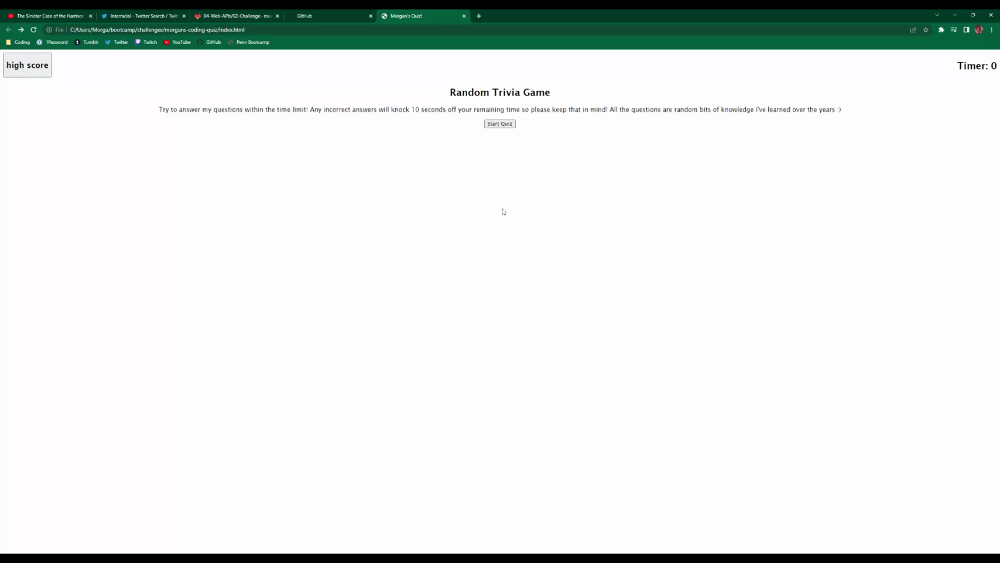

# Morgan's Quiz!

## Description

The motivation and purpose behind this project was to make a quiz that utilizes local storage, a timer, and javascript. I learned a lot about using javascript to create and append elements on the page. I also learned how to change "pages" without relying heavily on css and html.

## Usage

Link to deployed application: [Link to app](https://m-dickerson.github.io/morgans-coding-quiz/)

To play all you have to do is click the start button! The application handles the rest.

 

## Credits

I used this for making each array variable into a button: [stackoverflow](https://stackoverflow.com/questions/70708178/create-multiple-buttons-using-array-protoype-foreach-javascript)

## License

MIT License

A short and simple permissive license with conditions only requiring preservation of copyright and license notices. Licensed works, modifications, and larger works may be distributed under different terms and without source code.